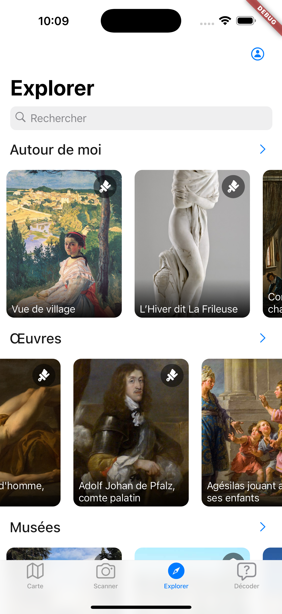

# Decod'Art

[](https://github.com/your-username/decodart-mobile/issues)
[](https://github.com/your-username/decodart-mobile/releases)
[](https://github.com/your-username/decodart-mobile/blob/main/LICENSE)


## Introduction
Decod'Art is an innovative mobile application that allows users to discover and interact with artworks in a fun and educational way. Through questions and challenges, users can deepen their knowledge of art and artists.

<table>
  <tr>
    <td></td>
    <td></td>
  </tr>
</table>

## Installation
To install the Decod'Art application, follow the steps below:

1. Clone the repository:
    ```sh
    git clone https://github.com/your-username/decodart-mobile.git
    ```
2. Navigate to the project directory:
    ```sh
    cd decodart-mobile
    ```
3. Install the dependencies:
    ```sh
    flutter pub get
    ```
4. Run the application on an emulator or physical device:
    ```sh
    flutter run
    ```

## Code structure
The project is structured as follows:

- `lib/`: Contains the main source code of the application.
  - `api/`: Manages API calls.
  - `controller_and_mixins/`: Controllers and mixins for state/widget management.
  - `model/`: Data models used in the application. It contains both model for the API and the local Hive database
  - `view/`: Views and widgets of the application.
  - `widgets/`: Reusable UI components.
- `test/`: Contains unit and integration tests.
- `images/`: Contains images used in the app.

## Contribution
Contributions are welcome! To contribute, please follow the steps below:

1. Fork the repository (Optional for accepted members).
2. Create a branch for your feature or bug fix:
    ```sh
    git checkout -b my-new-feature
    ```
3. Commit your changes:
    ```sh
    git commit -m "Add a new feature"
    ```
4. Push your branch:
    ```sh
    git push origin my-new-feature
    ```
5. Open a Pull Request.

## License
This project is licensed under the GNU General Public License v3.0. See the [LICENSE](LICENSE) file for more details.

## Contact
For any questions or suggestions, please contact the development team at maximiliense@gmail.com.